# AI Digital Crew — Architecture Document

> **Domain:** [aidigitalcrew.com](https://aidigitalcrew.com)
> **Last updated:** 2026-02-26 | **Version:** 4.0.0
>
> **Related docs:** [ROADMAP.md](./ROADMAP.md) (future feature directions) | [CLAUDE.md](./CLAUDE.md) (AI assistant guidelines)

---

## 1. System Overview

AI Digital Crew is a community-driven showcase for AI-powered open-source GitHub projects. Users authenticate via OAuth, submit repositories, and browse curated projects. A daily automation pipeline discovers trending repos, generates AI summaries, and publishes a newsletter.

```mermaid
graph TD
    %% ── Layer 1: Browser ──────────────────────────────
    subgraph BROWSER["🖥️ Browser — Frontend"]
        direction TB
        SPA["index.html SPA<br/><i>Vanilla JS, no build step</i>"]
        PROJECT_PAGE["project.html<br/><i>Individual project view</i>"]

        subgraph VIEWS["Views (navigateTo)"]
            HOME["Home<br/>Hero + Featured + Projects"]
            SEARCH["Search Page<br/>Fuse.js keyword + Embedding semantic<br/>+ GitHub Discovery"]
            TRENDING["Trending Page<br/>AI & Global pools + Movers<br/>+ Hugging Face Mode"]
        end

        subgraph UI_COMPONENTS["UI Components"]
            AUTH_UI["Auth UI<br/>(OAuth popup)"]
            SUBMIT["Submit Modal<br/>(600ms debounce)"]
            GRID["Project Grid<br/>(category tabs)"]
        end
    end

    %% ── Layer 2: CDN / Static Assets ──────────────────
    subgraph CDN["📦 CDN / Static Assets"]
        FONTS["Google Fonts<br/>Inter + Space Grotesk"]
        FUSE["Fuse.js v7.0.0<br/><i>jsDelivr</i>"]
        CONFETTI["canvas-confetti v1.6.0<br/><i>jsDelivr</i>"]
        FIREBASE_SDK["Firebase JS SDK v10.12<br/><i>gstatic.com</i>"]
    end

    %% ── Layer 3: Firebase ─────────────────────────────
    subgraph FIREBASE["🔥 Firebase"]
        direction TB
        AUTH["Auth<br/>GitHub · Google · Facebook OAuth"]

        subgraph FIRESTORE["Firestore Collections"]
            PROJECTS_COL["projects/<br/><i>public read, auth create</i>"]
            PROJECTS_CACHE["projectsCache/latest<br/><i>single-doc cache, public read</i>"]
            EMBEDDINGS_CACHE["embeddingsCache/<br/>meta + part{i}<br/><i>chunked embeddings</i>"]
            SEARCH_CACHE["searchCache/{hash}<br/><i>query embeddings, 24h TTL</i>"]
            SEARCH_ANALYTICS["searchAnalytics/<br/><i>auth write-only</i>"]
        end

        subgraph FUNCTIONS["Cloud Functions (2nd Gen, Node.js 24)"]
            GQE["getQueryEmbedding<br/><i>callable, us-central1</i><br/>Modes: embed · rankProjects · findSimilar · findSimilarBatch"]
            TREND_BADGE["trendBadge<br/><i>HTTP, us-central1</i><br/>Dynamic SVG badge"]
        end
    end

    %% ── Layer 4: External APIs (from Browser) ─────────
    subgraph EXTERNAL_BROWSER["🌐 External APIs (Browser-called)"]
        GITHUB_API["GitHub REST API<br/>GET /repos/{o}/{r}<br/>GET /search/repositories"]
        HF_API["Hugging Face API<br/>GET /api/models<br/>GET /api/spaces<br/>GET /api/daily_papers"]
        DICEBEAR["DiceBear API<br/>GET /7.x/avataaars/svg"]
    end

    %% ── Layer 5: Daily Pipeline ───────────────────────
    subgraph PIPELINE["⚙️ Daily Pipeline (GitHub Actions cron, 8 AM UTC)"]
        SCRAPER["daily-scrape.js<br/>Project discovery + trending + embeddings"]
        SUBSTACK_PUB["substack-publish.js<br/>ProseMirror payload builder"]
        PIPEDREAM["Pipedream<br/><i>webhook proxy</i>"]
        SUBSTACK["Substack API<br/><i>draft + publish</i>"]
    end

    %% ── Layer 6: AI / Embedding Services ──────────────
    subgraph AI_SERVICES["🤖 AI & Embedding Services"]
        GEMINI_EMBED["Gemini gemini-embedding-001<br/><i>3072 dimensions</i>"]
        GEMINI_GEN["Gemini gemini-2.5-flash<br/><i>writeups + quick-starts</i>"]
        CF_AI["Cloudflare Workers AI<br/>@cf/baai/bge-large-en-v1.5<br/><i>1024 dims, fallback</i>"]
    end

    %% ── Layer 7: Deployment / CI/CD ───────────────────
    subgraph DEPLOY["🚀 Deployment"]
        CF_PAGES_PROD["Cloudflare Pages<br/><b>main</b> → aidigitalcrew.com"]
        CF_PAGES_STG["Cloudflare Pages<br/><b>staging</b> → staging.aidigitalcrew.com"]
        FB_DEPLOY["Firebase CLI<br/><i>manual: Functions + Rules</i>"]
    end

    %% ── Connections ───────────────────────────────────

    %% Browser → CDN
    SPA -.->|"lazy import"| FUSE
    SPA -.->|"dynamic import on submit"| CONFETTI
    SPA -->|"module import"| FIREBASE_SDK
    SPA -.->|"preload"| FONTS

    %% Browser → Firebase
    AUTH_UI -->|"signInWithPopup"| AUTH
    SPA -->|"getDoc projectsCache/latest"| PROJECTS_CACHE
    PROJECT_PAGE -->|"getDoc projects/{id}"| PROJECTS_COL
    SUBMIT -->|"addDoc"| PROJECTS_COL
    SEARCH -->|"httpsCallable"| GQE
    SEARCH -->|"addDoc"| SEARCH_ANALYTICS

    %% Browser → External APIs
    SUBMIT -->|"GET /repos/{o}/{r}<br/>preview metadata"| GITHUB_API
    SEARCH -->|"GET /search/repositories<br/>stars:>100"| GITHUB_API
    TRENDING -->|"GET /api/models · /api/spaces<br/>GET /api/daily_papers"| HF_API
    SPA -->|"GET /7.x/avataaars/svg?seed={uid}"| DICEBEAR

    %% Cloud Functions → AI Services
    GQE -->|"embed query<br/>(primary)"| GEMINI_EMBED
    GQE -->|"embed query<br/>(fallback)"| CF_AI
    GQE -->|"R/W"| SEARCH_CACHE
    GQE -->|"read parts"| EMBEDDINGS_CACHE
    TREND_BADGE -->|"read by fullName"| PROJECTS_COL

    %% Pipeline → External
    SCRAPER -->|"search + README + issues"| GITHUB_API
    SCRAPER -->|"generate writeup"| GEMINI_GEN
    SCRAPER -->|"generate embeddings"| GEMINI_EMBED
    SCRAPER -->|"embeddings fallback"| CF_AI
    SCRAPER -->|"Admin SDK write"| PROJECTS_COL
    SCRAPER -->|"write cache"| PROJECTS_CACHE
    SCRAPER -->|"write chunks"| EMBEDDINGS_CACHE
    SCRAPER --> SUBSTACK_PUB
    SUBSTACK_PUB -->|"POST webhook"| PIPEDREAM
    PIPEDREAM -->|"create draft + publish"| SUBSTACK

    %% Deployment
    CF_PAGES_PROD -.->|"push to main"| SPA
    CF_PAGES_STG -.->|"push to staging"| SPA
    FB_DEPLOY -.->|"deploy --only functions"| FUNCTIONS
```



---

## 2. Tech Stack

| Layer | Technology | Notes |
|-------|-----------|-------|
| Frontend | Vanilla JS + HTML + CSS | Single-file SPA (`index.html`), no framework, no build step |
| Hosting (prod) | Cloudflare Pages | Auto-deploys on push to `main` via `deploy-cloudflare.yml` → `aidigitalcrew.com` |
| Hosting (staging) | Cloudflare Pages | Auto-deploys on push to `staging` via `deploy-staging.yml` → `staging.aidigitalcrew.com` |
| Auth | Firebase Auth v10.12 | GitHub, Google, Facebook OAuth providers |
| Database | Cloud Firestore | `projects`, `projectsCache`, `embeddingsCache`, `searchCache`, `searchAnalytics` collections |
| Cloud Functions | Firebase Functions (2nd Gen, Node.js 24) | `getQueryEmbedding` (callable) + `trendBadge` (HTTP) |
| Search (keyword) | Fuse.js v7.0.0 (CDN) | Client-side fuzzy search with weighted fields |
| Search (semantic) | Gemini Embeddings + Cloudflare Workers AI | Server-side embedding via Cloud Function, cosine similarity on client |
| Automation | GitHub Actions | Cron job (`daily-scrape.yml`) at 8 AM UTC (midnight PST) |
| AI Content | Google Gemini 2.5 Flash | Generates project writeups + quick-start guides |
| Newsletter | Substack | Published via Pipedream webhook bridge |
| Webhook Proxy | Pipedream | Bypasses Cloudflare restrictions on Substack API |
| Icons | Lucide Icons (CDN) | SVG icon library |
| Fonts | Google Fonts | Inter (body, weights 400/500/600), Space Grotesk (headings, weight 700) |
| Animations | canvas-confetti v1.6.0 (CDN) | Submission success animation |
| Avatars | DiceBear v7.x (API) | Fallback avatar generation when Firebase doesn't provide one |

---

## 3. External Services

### 3.1 Firebase

- **Project ID:** `ai-digital-crew` (Blaze plan)
- **Auth domain:** `ai-digital-crew.firebaseapp.com`
- **Services used:** Authentication, Cloud Firestore, Cloud Functions (2nd Gen)
- **Frontend SDK:** Firebase JS SDK v10.12.0 (loaded via CDN, includes `firebase-functions` for callable)
- **Backend SDK:** `firebase-admin ^12.0.0` (used in daily scrape + Cloud Functions)

### 3.2 GitHub REST API

| Endpoint | Used By | Purpose |
|----------|---------|---------|
| `GET /repos/{owner}/{repo}` | Frontend + scraper | Fetch repo metadata, live stats |
| `GET /search/repositories` | Frontend (search page) + scraper | GitHub discovery (stars:>100, 10 per page) + daily trending |
| `GET /repos/{owner}/{repo}/readme` | Scraper | Raw README for AI summarization |
| `POST /repos/{owner}/{repo}/issues` | Scraper | Notify owners of featured projects |

**API configuration:**
- **API version:** `X-GitHub-Api-Version: 2022-11-28` (explicit header)
- **Accept headers:** `application/vnd.github+json` (metadata), `application/vnd.github.raw` (README)
- **Auth:** Bearer token (personal access token)
- **Rate limits:** 5,000 req/hour (authenticated), Search API: 30 req/minute
- **Current usage:** ~15-20 requests per pipeline run (well within limits)

### 3.3 Google Gemini

- **Model:** `gemini-2.5-flash`
- **SDK:** `@google/generative-ai ^0.21.0`
- **Input:** Repo metadata + README (truncated to 4000 chars via `.slice(0, 4000)`)
- **Output:** JSON `{ writeup: string, quickStart: string[] }`
- **Edge case:** Gemini sometimes wraps JSON in markdown fences — stripped via regex: `text.replace(/^```(?:json)?\n?/, '').replace(/\n?```$/, '')`

### 3.4 Pipedream

- **Role:** Webhook proxy between GitHub Actions and Substack API
- **Why needed:** Substack API sits behind Cloudflare; Pipedream runs from trusted IPs
- **Flow:** `daily-scrape.js` → POST payload → Pipedream webhook → Substack draft → publish
- **Script format:** `pipenode.txt` uses Pipedream SDK (`defineComponent` + `export default`)
- **Auth:** The webhook URL itself is the only authentication — no additional headers sent
- **Idempotency:** None — duplicate webhook calls create duplicate Substack drafts

### 3.5 Substack

- **Publication:** `aidigitalcrew.substack.com`
- **Post format:** ProseMirror JSON (rich text, not HTML or markdown)
- **Auth:** Session cookie (`substack.sid`) stored in Pipedream environment variables — requires periodic refresh when cookie expires
- **Audience:** `everyone` — public posts sent to all subscribers + email
- **API endpoints:** `/api/v1/drafts` (create), `/api/v1/drafts/{id}/publish` (publish)
- **Payload fields:** `draft_title`, `draft_subtitle`, `draft_body` (ProseMirror JSON string), `draft_bylines` (empty array), `audience`, `type` ("newsletter")

### 3.6 DiceBear

- **Role:** Fallback avatar generation for users without a Firebase photo URL
- **Endpoint:** `https://api.dicebear.com/7.x/avataaars/svg?seed={uid}`
- **Behavior:** Seed-based — same UID always generates the same avatar

### 3.7 Hugging Face API

| Endpoint | Used By | Purpose |
|----------|---------|---------|
| `GET /api/models?sort=trendingScore&direction=-1&limit=50` | Frontend (trending page) | Fetch trending HF models |
| `GET /api/spaces?sort=trendingScore&direction=-1&limit=25` | Frontend (trending page) | Fetch trending HF spaces |
| `GET /api/daily_papers` | Frontend (trending page) | Fetch daily research papers |

- **Base URL:** `https://huggingface.co`
- **Auth:** None required (public API)
- **Used in:** Trending page's "Hugging Face" mode (toggled via `state.hfSource`)

### 3.8 Cloudflare Workers AI

- **Role:** Fallback embedding provider when Gemini is unavailable
- **Model:** `@cf/baai/bge-large-en-v1.5` (1024 dimensions)
- **Endpoint:** `https://api.cloudflare.com/client/v4/accounts/{accountId}/ai/run/@cf/baai/bge-large-en-v1.5`
- **Auth:** Bearer token (`CLOUDFLARE_API_TOKEN`)
- **Used by:** Cloud Function `getQueryEmbedding`, daily pipeline (`embedding-provider.js`)

---

## 4. Data Model

### 4.1 Firestore Collection: `projects`

```
projects/{projectId}
├── fullName: string          # "owner/repo" (unique identifier, used for dedup)
├── name: string              # repo name
├── owner: string             # GitHub username
├── ownerAvatar: string       # avatar URL
├── description: string       # GitHub repo description
├── stars: number             # stargazers_count
├── forks: number             # forks_count
├── language: string          # primary language
├── topics: string[]          # GitHub topics array
├── url: string               # GitHub html_url
├── submittedBy: string       # Firebase UID or "auto"
├── submittedByName: string   # display name or "AI Digital Crew Bot"
├── createdAt: timestamp      # server timestamp
├── source: string            # "user" | "auto"
├── category: string          # inferred from topics
│
│  (Auto-featured projects only)
├── writeup: string           # Gemini-generated summary
├── quickStart: string[]      # Gemini-generated steps
├── autoAddedDate: string     # "YYYY-MM-DD"
│
│  (Embedding vectors for semantic search)
├── embedding_gemini: number[]     # Gemini embedding (3072 dimensions)
├── embedding_cloudflare: number[] # Cloudflare BGE embedding (1024 dimensions)
│
│  (Trending / snapshot fields — written by daily pipeline)
├── trendScore: number             # composite trend score (0-100)
├── trendLabel: string             # "hot" | "rising" | "steady" | "cooling" | "new"
├── trendDirection: string         # "up" | "down" | "stable" | "new"
├── prevStars: number              # stars at previous snapshot
├── prevForks: number              # forks at previous snapshot
└── snapshots/                     # subcollection of daily stat snapshots
    └── {date}/
        ├── stars: number
        ├── forks: number
        └── timestamp: timestamp
```

### 4.2 Firestore Collection: `projectsCache`

```
projectsCache/latest
├── projects: array               # all project objects (denormalized)
├── updatedAt: timestamp          # last pipeline run time
└── count: number                 # total project count
```

Single-document cache — the frontend reads this one doc instead of querying the entire `projects` collection. Updated by the daily pipeline via Admin SDK.

### 4.3 Firestore Collection: `embeddingsCache`

```
embeddingsCache/meta
├── partCount: number             # number of part documents
├── totalProjects: number         # total projects with embeddings
└── updatedAt: timestamp

embeddingsCache/part{i}           # i = 0, 1, 2, ... (30 projects per doc)
├── projects: array
│   └── { fullName, embedding_gemini, embedding_cloudflare }
└── updatedAt: timestamp
```

Chunked embedding storage for server-side ranking in `getQueryEmbedding`. Written by the daily pipeline, read by Cloud Functions (1h in-memory cache).

### 4.4 Firestore Collection: `searchCache`

```
searchCache/{sha256Hash}
├── query: string              # normalized lowercase query
├── embedding: number[]        # embedding vector (3072 for Gemini, 1024 for Cloudflare)
├── provider: string           # "gemini" | "cloudflare"
├── dimensions: number         # vector dimensionality
└── createdAt: timestamp       # server timestamp (24h TTL)
```

Written by Cloud Functions only (Admin SDK). Client has read-only access.

### 4.5 Firestore Collection: `searchAnalytics`

```
searchAnalytics/{docId}
├── query: string              # search query text
├── resultCount: number        # number of results returned
├── clickedProject: string     # (optional) project that was clicked
├── clickPosition: number      # (optional) position in results list
├── timestamp: timestamp       # server timestamp
└── uid: string                # Firebase UID of searcher
```

Write-only from authenticated clients. No client reads (analytics are backend-only).

### 4.6 Security Rules

```
projects:        public read, authenticated create only
searchCache:     public read, no client write (Cloud Functions only)
searchAnalytics: authenticated create/update, no read
```

No update/delete rules on projects — defaults to deny. Daily bot writes via Firebase Admin SDK (bypasses rules).

### 4.7 Quotas & Limits

| Resource | Limit | Current Usage |
|----------|-------|---------------|
| Firestore reads | 50,000/day (free tier) | ~200-500/day (page loads + pipeline) |
| Firestore writes | 20,000/day (free tier) | 1-2/day (pipeline + user submissions) |
| GitHub API | 5,000 req/hour | ~15-20 per pipeline run |
| GitHub Search API | 30 req/minute | ~5 per pipeline run (one per category) |
| Gemini API | Varies by plan | 1 call per pipeline run |

---

## 5. Data Flows

### 5.1 User Submission

```
User → OAuth Login → Enter GitHub URL
  → Debounce 600ms → GET /repos/{owner}/{repo} → Preview card
  → Submit → Query Firestore (dedup check by fullName)
  → Write to Firestore → Confetti + success toast → Re-render grid
```

**Debounce details:**
- Timer stored in `let debounceTimer`, cleared on each keystroke
- Input border turns `var(--primary)` during fetch, resets after
- Preview shows: name, stars, forks, language, description
- Submit button only enabled if preview fetch succeeds

**Error states:**
- Repo not found / private → shows "Repository not found or is private."
- Duplicate detected → toast error "This project has already been submitted"
- Network failure → silent catch (preview simply doesn't render)

### 5.2 Daily "Project of the Day" Pipeline

```
GitHub Actions cron (8 AM UTC / midnight PST)
  │
  ├─ 1. Search GitHub API
  │     For each topic in CATEGORY_TOPICS (5 categories):
  │       query: "topic:{t} created:>7daysAgo stars:>30"
  │       per_page=10, sorted by stars desc
  │     Merge all results, dedup by full_name using Set
  │     Track topicCategory mapping alongside dedup
  │
  ├─ 2. Find new repo (not already in Firestore)
  │     Loop candidates in star-count order
  │     For each: query Firestore WHERE fullName == candidate
  │     Skip repos that are forks or have no description
  │     Pick first unmatched repo
  │     If all candidates exist → exit (no pick today)
  │
  ├─ 3. Fetch README
  │     GET /repos/{owner}/{repo}/readme (raw format)
  │     Truncate to 4000 chars via .slice(0, 4000)
  │
  ├─ 4. Generate writeup via Gemini 2.5 Flash
  │     Input: metadata + README
  │     Output: { writeup, quickStart }
  │     Strip markdown code fences if present
  │
  ├─ 5. Write to Firestore
  │     source: "auto", submittedBy: "auto"
  │     submittedByName: "AI Digital Crew Bot"
  │
  ├─ 6. Notify repo owner via GitHub Issue
  │     Title: "Your project was featured on AI Digital Crew"
  │     Uses NOTIFY_TOKEN if set, falls back to GITHUB_TOKEN
  │     Non-fatal: silently continues if notification fails
  │     (e.g., issues disabled, token lacks permission, repo deleted)
  │
  └─ 7. Publish to Substack
        substack-publish.js builds ProseMirror payload:
          ├─ Italic inbox hint (Gmail Primary delivery workaround)
          ├─ Writeup paragraphs
          ├─ "Quick Start" ordered list
          ├─ GitHub repo link
          └─ Footer: "— Auto-discovered by AI Digital Crew"
        POST to Pipedream webhook → create draft → publish
        Return published post URL
```

### 5.3 Page Load & Display

```
Browser loads index.html
  → Firebase Auth state listener fires
  → Firestore read: getDoc("projectsCache/latest") — single read, all projects
  → Check localStorage cache (sessionStorage fallback) — skip Firestore if fresh
  → For each project: fetch live stats from GitHub API (parallel via Promise.all)
  → Merge live stats with stored data (writeup, quickStart, trend fields preserved)
  → If GitHub API fails for a repo, silently preserve old stats
  → Infer categories from topics
  → Render grid with category filter tabs
  → Intersection Observer animates cards on scroll
  → Stat pills animate from 0 to target count (1200ms, cubic-out easing)
```

---

## 6. Authentication

### 6.1 Providers

| Provider | Firebase Class | Notes |
|----------|---------------|-------|
| GitHub | `GithubAuthProvider()` | Primary, aligns with project theme |
| Google | `GoogleAuthProvider()` | Broad reach fallback |
| Facebook | `FacebookAuthProvider()` | Social login users |

### 6.2 Account Linking

When a user signs in with Provider A but the email already exists on Provider B:

1. `signInWithPopup()` throws `auth/account-exists-with-different-credential`
2. Store pending credential in `state.pendingLinkCred` and provider name in `state.pendingLinkProvider`
3. Show toast (6000ms duration) prompting user to sign in with existing provider
4. User signs in with existing provider
5. On success, call `linkWithCredential(user, pendingCred)` to merge accounts
6. Non-fatal if linking fails — user remains signed in with existing provider

### 6.3 Account Deletion

1. Confirmation dialog
2. Query Firestore for all user's projects (`WHERE submittedBy == uid`)
3. Delete all user's projects from Firestore
4. Call `deleteUser(auth.currentUser)`
5. If `auth/requires-recent-login` error → show toast directing user to sign out and back in (no auto re-auth)

---

## 7. Frontend Architecture

### 7.1 State Management

Single global object — all UI updates flow from state mutations:

```js
state = {
  // Core
  user,                // FirebaseUser | null
  isLoggedIn,          // boolean
  projects,            // array of project objects
  isLoading,           // boolean
  repoPreview,         // temp preview data during submission
  activeCategory,      // current filter tab ("All", "AI Agents", etc.)
  currentView,         // "home" | "search" | "trending"
  pendingLinkCred,     // OAuthCredential for account linking
  pendingLinkProvider, // string: which provider is pending

  // Search
  searchQuery,         // current search query string
  searchResults,       // scored results array | null
  isSearching,         // boolean — true while embedding API call in progress
  githubResults,       // GitHub discovery results | null
  searchCache,         // Map — in-memory cache of search results (per session)
  githubResultsCache,  // Map — in-memory cache of GitHub API results (per session)
  lastGitHubApiCall,   // timestamp — rate limiting for GitHub search API

  // Trending
  trendingLoaded,      // boolean — true once trending data fetched
  trendingProjects,    // all projects with trend data
  trendingAiProjects,  // AI-category trending pool
  trendingGlobalProjects, // global trending pool
  trendSort,           // current sort column
  trendTimeRange,      // time range filter
  aiFilter,            // { category, language, search, page }
  globalFilter,        // { category, language, search, page }
  globalView,          // "grid" | "table"
  globalTableSort,     // { col, dir }
  moversTab,           // "risers" | "fallers"
  moversRange,         // time range for movers
  catLbActive,         // active category in leaderboard
  homeSource,          // "github" | "hf" — home page source toggle

  // Hugging Face
  hfSource,            // "models" | "spaces" | "papers"
  hfModels,            // HF trending models array
  hfSpaces,            // HF trending spaces array
  hfPapers,            // HF daily papers array
  hfLoaded,            // boolean
  hfLoading,           // boolean
  hfModelsFilter,      // { task, search, page }
  hfSpacesFilter,      // { search, page }
  hfPapersFilter,      // { search, page }
  hfTaskActive         // active HF task filter
}
```

### 7.2 Key UI Sections

| Section | Description |
|---------|-------------|
| Navbar | Sticky, blur-on-scroll (threshold: 60px), Home/Projects/Search links, avatar dropdown, mobile hamburger. Active link highlighted via `.nav-active` |
| Hero | Headline, "Browse Projects" CTA, animated stat pills (project count, total stars, % open source), 3 animated background orbs. No search bar (search is on its own page) |
| Featured | "Today's Pick" spotlight card with writeup + quick start (conditional — only if daily pick exists) |
| Search Page | Dedicated page (hidden by default). AI Search title, search input with autocomplete + discovery panel, trending pills, search result grid, GitHub discovery section. Accessed via "Search" nav link |
| Project Grid | 3-col responsive grid, category filter tabs (only populated categories shown), lazy animation |
| Submit Modal | URL input → 600ms debounced preview → submit with confetti |
| Login Modal | OAuth provider buttons (GitHub, Google, Facebook) |
| Footer | 3-column: About, Today's Pick (link to featured project), Support. Newsletter CTA linking to Substack |

**Empty states:**
- No projects at all: "No projects yet. Be the first to submit one!"
- No projects in filtered category: "No projects in this category yet."

### 7.3 Key Patterns

- **`esc()`** — HTML escape helper, prevents XSS in all dynamic content
- **Intersection Observer** — threshold `0.1` (10% visible), adds `.visible` class for fade-in + slide-up. Previous observer disconnected before creating new one to prevent memory leaks
- **Event delegation** — handles clicks on dynamically rendered project cards
- **600ms debounce** — on GitHub URL input; timer stored in `let debounceTimer`, cleared per keystroke
- **`Promise.all`** — parallel GitHub API fetches for live stats on page load
- **Stat pill animation** — `requestAnimationFrame` loop, 1200ms duration, cubic-out easing (`Math.pow`), `.toLocaleString()` for thousands separators

### 7.4 Navigation & View System

The SPA has three views controlled by `navigateTo(view)`:

| View | Visible Sections | Trigger |
|------|-----------------|---------|
| `home` | Hero, Featured, Projects (with category tabs) | "Home" or "Projects" nav link |
| `search` | Search Page (full-screen) | "Search" nav link |
| `trending` | Trending Page — AI pool, global pool, movers, category leaderboard, Hugging Face mode | "Trending" nav link |

`navigateTo()` toggles `display` on sections, scrolls to top, updates `.nav-active` on nav links, sets `state.currentView`, and updates the URL hash (`#home`, `#search`, `#trending`).

### 7.5 Search System

Search is a hybrid of keyword matching (Fuse.js) and semantic similarity (embeddings):

```
User types query
  → 300ms debounce
  → Intent classification:
      exact match → instant result
      "similar to X" → embedding-based similarity
      category keyword → category-boosted search
      default → full hybrid search
  → Fuse.js keyword search (client-side, weighted fields)
  → getQueryEmbedding Cloud Function (server-side)
      → Check Firestore searchCache (24h TTL)
      → Gemini embedding (primary) or Cloudflare Workers AI (fallback)
  → Cosine similarity: query embedding vs project embeddings
  → Combined score: 0.7 * semantic + 0.3 * keyword (when both present)
  → Render results in #search-result-grid (capped at 12)
  → GitHub Discovery: parallel GitHub API search (stars:>100, 10 results)
      → Filter out projects already in catalog
      → Show as secondary section (or primary if 0 local results)
```

**Autocomplete:** Fuse.js over project names + topics, shown on input (min 2 chars), keyboard navigation (arrow keys + Enter).

**Discovery panel:** Shown on search input focus (when empty). Contains recent searches (localStorage), trending queries, category chips.

**Trending pills:** 5 pre-set queries displayed below search input.

**Match badges:** "Best Match" (score >= 0.6), "Good Match" (>= 0.4), "Related" (< 0.4).

**Similar projects:** Collapsible section on each result card showing top 3 similar projects by embedding distance.

**Caching layers:**
1. `state.searchCache` — in-memory Map, per browser session
2. `state.githubResultsCache` — in-memory Map, per browser session
3. Firestore `searchCache` — server-side embedding cache, 24h TTL

### 7.6 Cloud Functions

**`getQueryEmbedding`** (2nd Gen, `us-central1`, Node.js 24):

- **Trigger:** Callable from frontend via `httpsCallable(functions, 'getQueryEmbedding')`
- **Modes of operation (all via same callable):**
  - **Standard embed** — Input: `{ query: string }` → Output: `{ embedding, provider, dimensions, cached }`
  - **`rankProjects`** — Input: `{ query, rankProjects: true }` → Embeds query + ranks against `embeddingsCache` server-side
  - **`findSimilar`** — Input: `{ findSimilar: "owner/repo" }` → Returns top 12 similar projects from `embeddingsCache`
  - **`findSimilarBatch`** — Input: `{ findSimilarBatch: ["owner/repo", ...] }` (up to 12) → Batch similar projects
- **Provider chain:** Gemini `gemini-embedding-001` (3072 dims) → Cloudflare Workers AI `bge-large-en-v1.5` (1024 dims)
- **Caching:** SHA-256 hash of normalized query → Firestore `searchCache` doc (24h TTL); `embeddingsCache` parts cached 1h in-memory
- **Rate limiting:** 20 calls/min per UID (in-memory counter)
- **Secrets:** `GEMINI_API_KEY`, `CLOUDFLARE_ACCOUNT_ID`, `CLOUDFLARE_API_TOKEN` (via Secret Manager)
- **Max instances:** 10

**`trendBadge`** (2nd Gen, `us-central1`, HTTP):

- **Trigger:** HTTP GET `?repo=owner/repo`
- **Output:** Dynamic SVG badge (shields.io style) with trend score + label (hot/rising/steady/cooling/new)
- **Data source:** Reads `projects/` by `fullName`
- **Caching:** `Cache-Control: public, max-age=3600`
- **CORS:** Enabled
- **No external API calls** — pure Firestore read + SVG generation

### 7.7 Toast Notification System

- **Position:** Fixed bottom-right, `z-index: 9999`
- **Types:** `success` (green, check-circle icon), `error` (red, x-circle icon), `info` (blue, info icon)
- **Default duration:** 3000ms (configurable per call, e.g., 6000ms for account linking prompts)
- **Animation:** `slideIn` on appear, `slideOut` on dismiss (CSS keyframes)
- **Icons:** Lucide SVG icons matched to toast type

### 7.8 Category System

Categories are inferred from GitHub topics at render time:

```
AI Agents, LLM / GenAI, Data Science, Big Data, DevTools,
Web / Frontend, Backend / APIs, Mobile, Security,
Cloud / Infra, Blockchain / Web3, Database, Other
```

**Mapping logic:** For each project, iterate through `CATEGORY_TOPICS` keyword map. First match wins (order matters — AI Agents checked first). If no topic matches → "Other". Falls back to stored `project.category` field if present.

Only categories with matching projects appear as filter tabs.

### 7.9 CSS Architecture

**Custom properties (`:root`):**

| Variable | Value | Usage |
|----------|-------|-------|
| `--bg` | `#0a0a0f` | Page background |
| `--surface` | `rgba(255,255,255,0.03)` | Card/modal background |
| `--border` | `rgba(255,255,255,0.08)` | Borders |
| `--primary` | `#3b82f6` | Primary blue |
| `--primary-end` | `#8b5cf6` | Gradient end (purple) |
| `--text` | `#f1f5f9` | Primary text |
| `--text-muted` | `rgba(255,255,255,0.5)` | Secondary text |
| `--success` | `#10b981` | Success states |
| `--error` | `#ef4444` | Error states |
| `--radius` | `16px` | Border radius |

**Key visual patterns:**
- **Glass morphism:** `.glass` class with `backdrop-filter: blur(12px)` (includes `-webkit-` prefix for Safari)
- **Background orbs:** 3 animated blur orbs (`filter: blur(80px)`, `will-change: transform`) with infinite 20-25s animations. Colors: blue, purple, cyan
- **Gradient buttons:** `background-size: 200% 200%` with animated `background-position` on hover
- **Skeleton loading:** Shimmer animation — `background-size: 200% 100%`, moves position over 1.5s

### 7.10 Responsive Breakpoints

| Breakpoint | Grid | Hero Font | Nav | Footer |
|-----------|------|-----------|-----|--------|
| > 768px | 3 columns | 64px | Desktop links + avatar | 3 columns |
| <= 768px | 2 columns | 36px | Hamburger menu, hide nav-links/nav-right | 2 columns |
| <= 480px | 1 column | 28px | Reduced padding, vertical CTAs | 1 column |

**Mobile menu:** Absolute-positioned panel with glass morphism. Click-outside handler closes menu. No touch-specific event handling.

**Avatar dropdown:** Toggle on click, auto-close on outside click via `event.stopPropagation()`.

---

## 8. Staging Environment

### 8.1 Overview

A staging environment allows testing UI changes, new features, and pipeline behavior before promoting to production.

| Aspect | Production | Staging |
|--------|-----------|---------|
| Branch | `main` | `staging` |
| URL | `aidigitalcrew.com` (Cloudflare Pages) | `staging.aidigitalcrew.com` (Cloudflare Pages preview) |
| Firebase project | `ai-digital-crew` | `ai-digital-crew-staging` |
| Scrape schedule | 8 AM UTC | 8 AM UTC |
| Owner notification | Yes | **No** (`SKIP_NOTIFY=true`) |
| Substack publishing | Yes | **No** (`SKIP_PUBLISH=true`) |
| Local dev (`localhost`) | — | Points to staging Firebase |

### 8.2 Environment Detection

`index.html` detects the environment at runtime by hostname:

- **Staging hosts:** `staging.aidigitalcrew.com`, `localhost`, `127.0.0.1` → uses staging Firebase config
- **All other hosts** (including `aidigitalcrew.com`) → uses production Firebase config
- When on staging, `document.title` is prefixed with `[STAGING]`

### 8.3 Pipeline Skip Flags

`daily-scrape.js` supports two environment variables:

| Env Var | Effect | Default |
|---------|--------|---------|
| `SKIP_NOTIFY=true` | Skips GitHub Issue creation (owner notification) | Unset (notify) |
| `SKIP_PUBLISH=true` | Skips Substack newsletter publishing | Unset (publish) |

### 8.4 Required Secrets (Staging)

| Secret | Purpose |
|--------|---------|
| `STAGING_FIREBASE_SERVICE_ACCOUNT` | Service account JSON for `ai-digital-crew-staging` project |

Staging reuses `GITHUB_TOKEN` and `GEMINI_API_KEY` from production. It does not need `NOTIFY_TOKEN` or `PIPEDREAM_WEBHOOK_URL`.

### 8.5 Firestore Rules (Staging)

Firestore rules must be deployed separately to the staging project. The daily scrape writes via the Admin SDK (bypasses rules), but the frontend reads via the client SDK and requires `allow read: if true` to be in place.

```bash
firebase deploy --only firestore:rules --project ai-digital-crew-staging
```

This is a one-time setup step. Re-deploy to staging whenever `firestore.rules` changes.

---

## 9. Deployment & CI/CD

### 9.1 Web Hosting

- **Production:** Cloudflare Pages (auto-deploys on push to `main` via `deploy-cloudflare.yml`), domain `aidigitalcrew.com`
- **Staging:** Cloudflare Pages (auto-deploys on push to `staging` via `deploy-staging.yml`), URL `staging.aidigitalcrew.com`
- **No build step** — `index.html` is the deployed artifact
- **Cloudflare Pages project:** `aidigitalcrew` (prod uses `main` branch, staging deploys as branch preview)

### 9.2 Cloud Functions

Deployed manually when `functions/` code changes:

```bash
firebase deploy --only functions --project ai-digital-crew
firebase deploy --only functions --project ai-digital-crew-staging
```

### 9.3 Firestore Rules

Deployed manually only when `firestore.rules` changes:

```bash
firebase deploy --only firestore:rules --project ai-digital-crew
```

### 9.4 GitHub Actions Workflows

| Workflow | Trigger | Purpose |
|----------|---------|---------|
| `deploy-cloudflare.yml` | Push to `main` | Deploy to Cloudflare Pages production (`aidigitalcrew.com`) |
| `deploy-staging.yml` | Push to `staging` | Deploy to Cloudflare Pages staging (`staging.aidigitalcrew.com`) |
| `daily-scrape.yml` | Cron `0 8 * * *` + `workflow_dispatch` | Daily project discovery + trending + newsletter (production) |
| `daily-scrape-staging.yml` | Cron `0 8 * * *` + `workflow_dispatch` | Daily scrape on staging (no notify/publish) |

**Workflow details:**
- **Node version:** 20 (via `actions/setup-node@v4`)
- **Working directory:** `scripts/` for both `npm install` and `node daily-scrape.js`
- **Permissions:** `contents: read` (minimal — only needs to read repo files)
- **Caching:** None — `npm install` runs fresh every time (no `actions/cache` or setup-node cache param)
- **Manual trigger:** Supports `workflow_dispatch` but no custom input parameters (no dry-run, skip-notify, etc.)
- **Failure handling:** No retry logic — if the job fails, it fails silently (GitHub sends default failure email to repo owner)

### 9.5 Environment Variables (GitHub Secrets)

| Secret | Used By | Purpose | Notes |
|--------|---------|---------|-------|
| `FIREBASE_SERVICE_ACCOUNT` | daily-scrape.js | Admin Firestore access | JSON service account key |
| `GITHUB_TOKEN` | daily-scrape.js | Search repos, fetch README | PAT with repo access |
| `NOTIFY_TOKEN` | daily-scrape.js | Create GitHub issues (owner notification) | Optional — falls back to `GITHUB_TOKEN` if unset. Separate token allows different permission scope |
| `GEMINI_API_KEY` | daily-scrape.js | AI writeup generation | Google AI Studio key |
| `PIPEDREAM_WEBHOOK_URL` | substack-publish.js | Trigger Substack publication | URL is the auth mechanism |
| `STAGING_FIREBASE_SERVICE_ACCOUNT` | daily-scrape-staging.yml | Admin access to staging Firebase project | JSON service account key for `ai-digital-crew-staging` |
| `CLOUDFLARE_API_TOKEN` | deploy-cloudflare.yml, deploy-staging.yml | Cloudflare Pages deployment | Wrangler API token |
| `CLOUDFLARE_ACCOUNT_ID` | deploy-cloudflare.yml, deploy-staging.yml | Cloudflare Pages deployment | Account identifier |

**Cloud Function Secrets (Firebase Secret Manager):**

| Secret | Used By | Purpose |
|--------|---------|---------|
| `GEMINI_API_KEY` | `getQueryEmbedding` function | Gemini embedding API (primary provider) |
| `CLOUDFLARE_ACCOUNT_ID` | `getQueryEmbedding` function | Cloudflare Workers AI account |
| `CLOUDFLARE_API_TOKEN` | `getQueryEmbedding` function | Cloudflare Workers AI auth token |

These are set on both `ai-digital-crew` (prod) and `ai-digital-crew-staging` projects via `firebase functions:secrets:set`.

**Frontend (hardcoded in `index.html`):**
- `firebaseConfig` object (API key, authDomain, projectId, etc.) — public by design, security enforced by Firestore rules and Cloud Console restrictions

---

## 10. Security

### 10.1 Frontend

- All dynamic content escaped via `esc()` helper (XSS prevention)
- GitHub URL validated via regex (`/github\.com\/([^/]+)\/([^/\s#?]+)/`) before API call
- Firebase config is public (safe by design — security enforced by rules)
- Modal overlays prevent accidental clicks on background content

### 10.2 Firestore Rules

- Public read on `projects` — intentional, it's a public showcase
- Authenticated create only — prevents anonymous spam
- No update/delete — users cannot modify or remove submissions via client
- Admin operations (daily bot) use Firebase Admin SDK (bypasses rules)

### 10.3 HTTP Headers (`_headers`)

```
X-Content-Type-Options: nosniff
X-Frame-Options: DENY
X-XSS-Protection: 1; mode=block
Referrer-Policy: strict-origin-when-cross-origin
Permissions-Policy: camera=(), microphone=(), geolocation=()
```

- Static assets (`/assets/*`) cached 7 days: `Cache-Control: public, max-age=604800`
- `index.html` has no explicit cache header — relies on Cloudflare Pages defaults

### 10.4 `.gitignore` Protection

Prevents accidental commit of secrets and vendor files:

| Pattern | Protects Against |
|---------|-----------------|
| `ai-digital-crew-firebase-adminsdk-*.json` | Firebase Admin SDK service account keys |
| `scripts/node_modules/` | Vendor dependencies |
| `.env` / `.env.*` | Environment variable files |
| `.DS_Store`, `Thumbs.db` | OS artifacts |
| `.idea/`, `.vscode/`, `*.swp` | Editor artifacts |

### 10.5 API Key Hardening (Cloud Console)

The Firebase Web API key in `index.html` is public by design but should be restricted:

- **Application restrictions:** HTTP referrers limited to `aidigitalcrew.com/*` and `localhost/*`
- **API restrictions:** Only Identity Toolkit API, Cloud Firestore API, Firebase Auth API

### 10.6 Security Audit (2026-02-20)

Full git history audit performed to check for leaked secrets.

**Findings:**

| Item | In Source | In Git History | Risk | Action |
|------|----------|---------------|------|--------|
| Firebase Web API key (`AIzaSy...`) | Yes (`index.html`) | Yes | **None** — public by design | Keep in source; lock down via Cloud Console (see 9.5) |
| Firebase Admin SDK JSON (`*adminsdk*.json`) | No (local only) | Never committed | **Mitigated** | Protected by `.gitignore` |
| `.env` files | No | Never committed | **Mitigated** | Protected by `.gitignore` |
| `private_key` in any file | No | Never committed | **None** | N/A |
| GitHub / Gemini / Pipedream tokens | No | Never committed | **None** | Stored in GitHub Actions Secrets only |

**Decision:** No git history rewrite needed — no real secrets were ever committed. The Firebase Web API key is a public project identifier (like a project ID), not a secret. Security is enforced by Firestore rules, Firebase Auth, and Cloud Console API restrictions.

**Ongoing safeguards:**
- `.gitignore` blocks service account keys, `.env` files, and `node_modules`
- Cloud Console API key restrictions (domain + API scope) limit abuse surface
- All sensitive tokens live exclusively in GitHub Actions Secrets

---

## 11. Error Handling & Resilience

### 11.1 Frontend Error Handling

| Scenario | Behavior |
|----------|----------|
| GitHub API fails during live stats refresh | Silent catch — preserves previously stored stats |
| Repo not found during submission preview | Shows "Repository not found or is private." (does not distinguish 404 vs 403 vs timeout vs rate limit) |
| Firestore duplicate check query fails | Error not surfaced — may allow duplicate submission |
| Account deletion needs re-auth | Shows toast directing user to sign out/in manually (no auto re-auth flow) |
| Network offline | No explicit offline handling — Firebase SDK may cache reads |

### 11.2 Pipeline Error Handling

| Scenario | Behavior |
|----------|----------|
| GitHub search fails for a category | `console.warn()` + continues to next category |
| All candidates already in Firestore | Exits gracefully with log message (no pick today) |
| README fetch fails | Pipeline continues without README context |
| Gemini returns invalid JSON | Strips markdown fences, then `JSON.parse()` — if still invalid, pipeline throws |
| Gemini API timeout/error | No retry — pipeline aborts |
| Firestore write fails | No retry — pipeline aborts |
| Owner notification fails | Non-fatal — `console.warn()` and continues to Substack publish |
| Pipedream webhook fails | Pipeline logs error — no retry |
| Substack draft/publish fails | Pipedream throws raw `res.text()` error (not parsed as JSON) |

### 11.3 Known Gaps

- **No retry logic anywhere** — transient failures (network blips, rate limits) cause full pipeline failure
- **No rate limit header checking** — doesn't inspect `X-RateLimit-Remaining` from GitHub
- **No idempotency** — duplicate Pipedream webhook calls create duplicate Substack drafts
- **README truncation is naive** — `.slice(0, 4000)` may cut mid-word or mid-sentence

---

## 12. Observability & Monitoring

### 12.1 Current State

| Aspect | Status |
|--------|--------|
| Logging | `console.log/warn/error` only — visible in GitHub Actions run logs |
| Log persistence | GitHub Actions UI only — no external log aggregation |
| Error tracking | None (no Sentry, Datadog, etc.) |
| Pipeline metrics | None — no success/failure rate tracking |
| Alerting | GitHub Actions default failure email to repo owner only |
| Uptime monitoring | None — no health checks on `aidigitalcrew.com` |
| Analytics | Firebase `measurementId` configured (`G-4VHGMK995P`) but no explicit event tracking |

### 12.2 Troubleshooting Guide

| Symptom | Check |
|---------|-------|
| "Daily scrape didn't run" | GitHub Actions → `daily-scrape.yml` run history. Check for cron skip or job failure |
| "Newsletter not published" | Check Pipedream webhook logs. Verify `substack.sid` cookie hasn't expired |
| "Projects not appearing" | Check Firestore console for documents. Check browser console for API errors |
| "User can't log in" | Check Firebase Auth console for provider config. Check for account-exists-with-different-credential |
| "Stats show old numbers" | GitHub API rate limit may be hit — check browser Network tab for 403 responses |

---

## 13. Substack Newsletter Details

### 13.1 ProseMirror Document Structure

Every newsletter post follows this structure:

```
doc
├── paragraph (italic)     → Gmail inbox hint: "Move to Primary..."
├── paragraph (empty)      → spacer
├── paragraph[]            → writeup (one paragraph node per text block)
├── paragraph (empty)      → spacer
├── paragraph (bold)       → "Quick Start" heading
├── orderedList            → quick-start steps
│   └── listItem[]
│       └── paragraph      → step text
├── paragraph (empty)      → spacer
├── paragraph (bold+link)  → "View on GitHub →" with repo URL
├── paragraph (empty)      → spacer
└── paragraph (italic)     → footer: "— Auto-discovered by AI Digital Crew"
```

**Text node marks:** `bold`, `italic`, `link` (with `attrs: { href, target: "_blank" }`)

### 13.2 Pipedream Script (`pipenode.txt`)

- **Format:** Pipedream SDK component (`defineComponent` + `export default`)
- **Runs on:** Pipedream infrastructure (not in this repo's CI)
- **Environment vars (Pipedream):** `SUBSTACK_SID` (session cookie), `SUBSTACK_URL` (publication URL)
- **Steps:** Create draft → Publish draft
- **Error handling:** Throws raw response text on non-OK status (no JSON parsing of errors)

---

## 14. Project Structure

```
ai-digital-crew/
├── index.html                  # Main SPA (HTML + CSS + JS — home, search, trending views)
├── project.html                # Individual project detail page
├── firebase.json               # Firebase project config (hosting + functions + Firestore)
├── firestore.rules             # Firestore security rules
├── _headers                    # HTTP security headers
├── CNAME                       # Custom domain: aidigitalcrew.com
├── CLAUDE.md                   # AI assistant project guidelines
├── ROADMAP.md                  # Future feature directions
├── ARCHITECTURE.md             # This file
├── .gitignore                  # Protects secrets & vendor files from commit
│
├── functions/
│   ├── index.js                # Cloud Functions: getQueryEmbedding (callable) + trendBadge (HTTP)
│   ├── package.json            # Node deps (firebase-admin, firebase-functions, generative-ai)
│   └── package-lock.json
│
├── scripts/
│   ├── daily-scrape.js         # Daily pipeline orchestrator
│   ├── substack-publish.js     # Pipedream/Substack payload builder
│   ├── embedding-provider.js   # Shared embedding logic (Gemini + Cloudflare) for backfill
│   ├── backfill-embeddings.js  # One-time script to generate embeddings for existing projects
│   ├── capture_console.py      # Debug tool: Playwright browser console capture (not used in prod)
│   ├── package.json            # Node deps (firebase-admin, generative-ai)
│   └── package-lock.json
│
├── .github/
│   └── workflows/
│       ├── deploy-cloudflare.yml     # Deploy main → Cloudflare Pages production
│       ├── deploy-staging.yml        # Deploy staging → Cloudflare Pages staging
│       ├── daily-scrape.yml          # Production cron (8 AM UTC) + manual trigger
│       └── daily-scrape-staging.yml  # Staging cron (no notify/publish)
│
└── pipenode.txt                # Pipedream Node.js script (Substack API calls, runs on Pipedream infra)
```

**Note:** `scripts/capture_console.py` is a Playwright-based debugging utility that loads the site in a headless browser and captures console logs, page errors, and request failures. It waits 15 seconds for async operations and checks project count / DOM state. Not part of the production pipeline.

---

## Changelog

| Date | Version | Changes |
|------|---------|---------|
| 2026-02-19 | 1.0.0 | Initial architecture document |
| 2026-02-20 | 1.1.0 | Added `.gitignore`, API key hardening, security sections 9.4-9.5 |
| 2026-02-20 | 1.2.0 | Added security audit findings (section 9.6) — no secrets in git history |
| 2026-02-20 | 2.0.0 | Comprehensive update: added DiceBear, toast system, CSS architecture, responsive breakpoints, error handling & resilience, observability & monitoring, Substack newsletter details, troubleshooting guide, rate limits & quotas, pipeline implementation details, known gaps, related doc links |
| 2026-02-20 | 2.1.0 | Added staging environment (section 8): hostname-based config detection, pipeline skip flags, deploy-staging + daily-scrape-staging workflows, staging secrets, Firestore rules deployment |
| 2026-02-21 | 3.0.0 | Added AI-powered semantic search system: dedicated search page, Cloud Functions (getQueryEmbedding), Fuse.js keyword search, embedding providers (Gemini + Cloudflare), new Firestore collections (searchCache, searchAnalytics), GitHub discovery, navigation/view system, updated system diagram and project structure |
| 2026-02-26 | 4.0.0 | Comprehensive architecture update: replaced ASCII diagram with Mermaid (renders on GitHub), added trending view + Hugging Face integration, added `projectsCache/` + `embeddingsCache/` collections, added `trendBadge` Cloud Function + `findSimilar`/`rankProjects` modes, updated hosting to Cloudflare Pages, added `deploy-cloudflare.yml` workflow, fixed cron to 8 AM UTC, added trend fields to projects schema, updated state object with trending/HF fields, added `project.html`, updated staging URLs |
